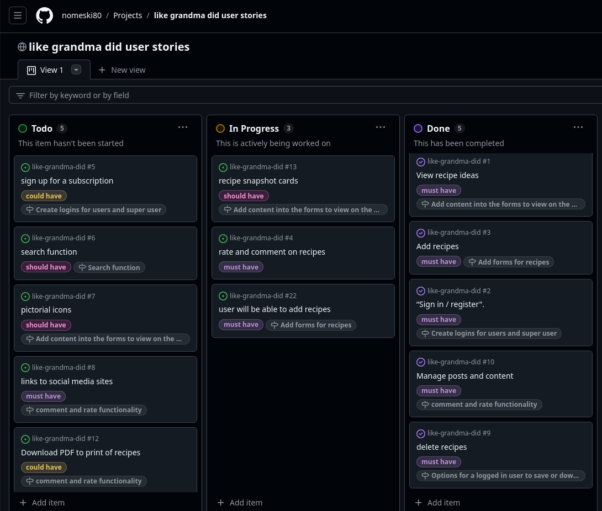
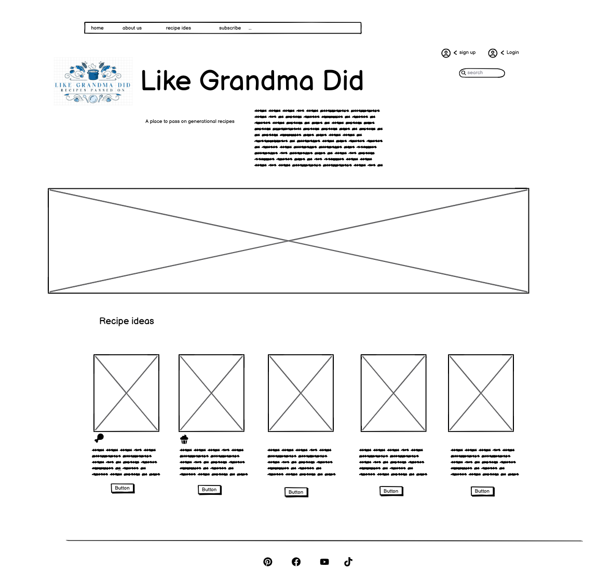
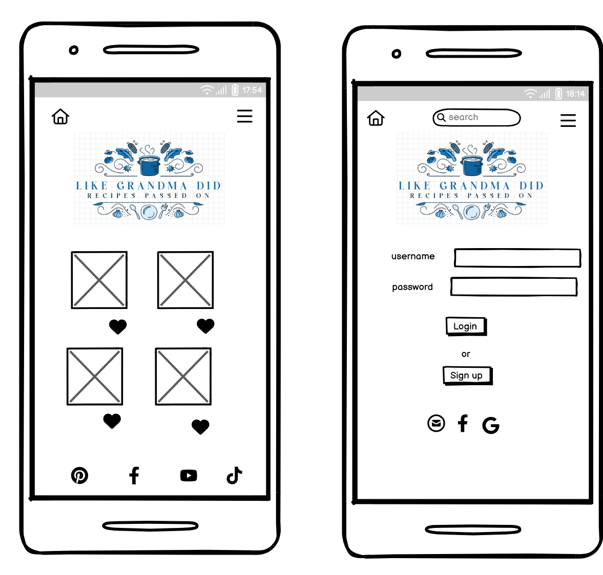
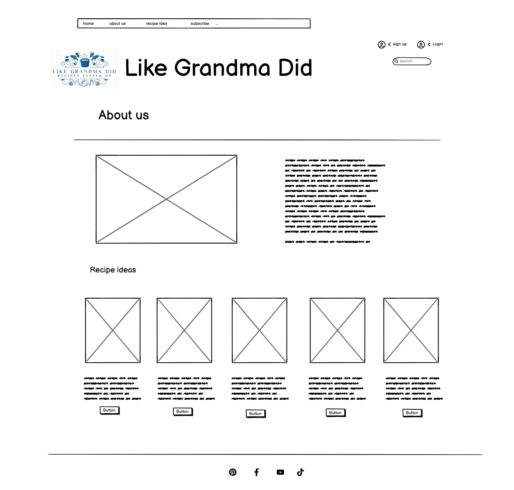
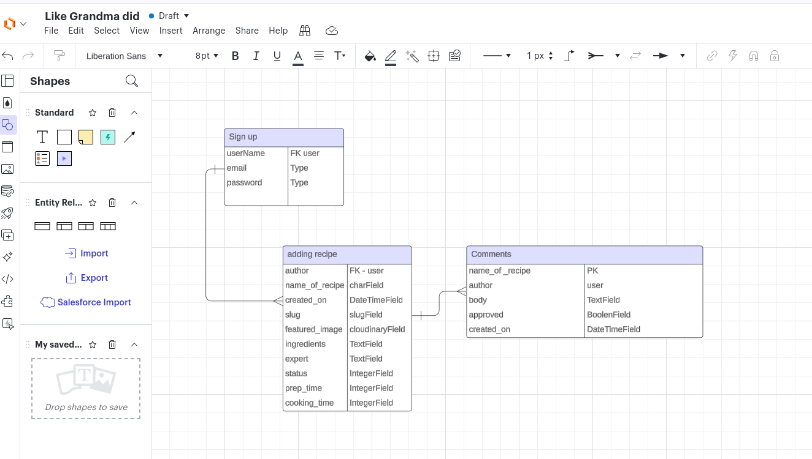
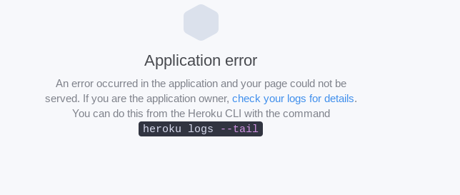

# Like Grandma

Welcome to Like Grndama Did, a website designed to treasure those delicious memories and special family traditions that we have passed down through generations. We can share some new ones to pass on in the future too!

The site has been built with Django, JavaScript, HTML and CSS styling to enable the user to have full CRUD functionality of the site. The site is targeted towards users who have a nostalgic love of food and treasure the memories and moments to share with the loved ones in their family.

# add screenshot of home page here

# view the live website here...

## Table of Contents

1. [User Experience Design](#user-experience)
2. [The Strategy Plane](#strategy-plane)
3. [Site Goals](#site-goals)
4. [Milestones](#milestones)
5. [User Stories](#user-stories)
6. [The Scope Plane](#the-scope-plan)
7. [The Structure Plane](#the-structure-plane)
8. [Opportunities](#opportunities)
9. [Wire frames](#wireframes)
10. [Database Schema](#datebase-schema)
11. [The Surface Plane](#the-serface-plane)
12. [Features](#features)
13. [Future Enhancements](#future-enhancements)
14. [Technologies Used](#technologies-used)
15. [Testing](#testing)
16. [Deployment](#deployment)
17. [Forking](#forking)
18. [Bugs and Issues](#bugs-and-issues)
19. [Credits](#credits)

## User Experience Design (UX)

The idea behind Like Grandma Did is to be a community site for users to share and create their family recipes with others, enabling them to keep traditions alive and to pass on the love of food and cooking together. Users will also be able to explore recipes written by other users from around the world. The graphical elements and overall design of the site provide the user with a simple and easy to navigae environment.
# The Sites Ideal User
Like Grandma did is looking for users who like to cook and learn about cooking wholesome and hearty traditional meals. Users who are happy to share ideas and recipes with others and to give constructive feedback or comments on how they got on and what alternatives people might like to try.

## The Strategy Plane
My ambitions for this site and the ideas I had for it were way above what I have actually be able to achieve before the submission date. I thought about the user stories early on but not in as clear as detail and broken down as I should have. If I had spent more time early on thinking about the milestones and the criteria needed to complete each one, perhaps I could have planned out my workload more effectively and achieved more in a timely manner. Please see below for the links to the Kanban board and my Project in GitHub.

[link to the User stories can be found here: ](https://github.com/users/nomeski80/projects/5/views/1)

## Site Goals

The goals of this site are to provide an effective, easy-to-use, step-by-step guide to cooking traditional family handed-down recipes. To encourage people to go back to their roots and to think about what happy nostalgic memories they have from their own childhood and the quality time they may have spent with their grandparents. The app should be visually pleasing, easy to navigate, intuitive to use and an essential tool for the kitchen when cooking for the family.

## Milestones -

11 milestones were created to plan out the project and they were divided into the User stories with the labels must have, should have and might have. These can be viewed here on the kanban board.
- Create an app with Django and deploy on Heroku
- Plan and design site Features
- testing of the app
- write up the ReadMe file
- Create an About Grandma page
- Create a user sign-in form with authentication
- Create forms for users to comment on recipes
- Create forms for users to add their recipes
- Search function
- add content to populate the site
- add functionality for the user to save and download a recipe

## User Stories
User Stories have been written out in the Kanboard and matched with the milestones, they have been labelled and prioritized with 'must have, 'should have' and 'could have'.

“View recipe ideas".
Content - "As a site user, I can view a list of recipes so that I can select which recipe I want to view."
AC1 - "Given more than one recipe in the database, these multiple recipes are listed."
AC2 - "When a user opens the main page a list of recipes are seen."
AC3 - "Then the user sees all recipe titles with pagination to choose what to read."

 
“Sign in / register".
Content - "As a site user, I can register and sign in so that I can access my account."
AC1 - "Simple, functional form to sign in with email or socials."
AC2 - "When a user opens the main page sign in/ register option is seen."
AC3 - "Sign in has authentication."
AC4 - “User is notified when signed in successfully or when a mistake has been made”

 
“Add recipe".
Content - "As a site user, I can add a recipes so that I can share my own ideas and recipes."
AC1 - "easily add images and details about my recipe."
AC2 - "user receives  a message that recipe had been received."
AC3 - "site user can view recipe as it would display when published."

 
“Rate / comment on other recipes".
Content - "As a site user, I can comment or rate a recipe I have tried so that I can give feedback and view other people’s feedback"
AC1 - "Simple, functional 5 star rating system"
AC2 - "Comment form is simple and functional to use."
AC3 - "must be signed in to rate or comment."

 
“sign up for a subscription".
Content - "As site admin, I can access data on subscribers so that I can share new posts and recipes"
AC1 - "easily sign up for the subscription ( site user)"
AC2 - "access the information about site users ."
AC3 - "share new posts/ recipes"

 
“Search function”.
Content - "As a site user, I can search recipes with key words so that I can easily find recipes that I
need.”
AC1 - "Search box on each page"
AC2 - "CRUD functionality to be able to read the information."

 
“pictural icons".
Content - "As a site user, I can easily see the time, difficulty and expense of a recipe in icon format so that I
can quickly glance through the information to find what I need"
AC1 - "Clear easy to understand icons"
AC2 - "consistency used throughout the site, location, colour, size."

 
“Links to socials”.
Content - "As a site user, I can share my other socials information so that I can easily build my online presence/ following.”
AC1 - "Clickable icons on the footer of each page"
AC2 - "Consistency used throughout the site, location, colour, size."

 
“ Edit or delete my post”
Content - "As a Site User I can modify or delete my comment on a recipe / post".
AC1 - "Clear easy to understand icons"
AC2 - "consistency used throughout the site, location, colour, size."

 
“Manage posts”.
Content - "As a Site Admin I can create, read, update and delete posts so that I can manage my blog content.”
AC1 - "Clickable icons on the footer of each page"
AC2 - "Consistency used throughout the site, location, colour, size."

## The Scope Plane
## The Structure Plane
## Opportunities
Taken from the user stories.
**Opportunities**|**Importance**|**Viability / Feasibility**
:-----:|:-----:|:-----:
“View recipe ideas"|5|5
"Sign in / register"|5|5
"Add recipe"|5|3
Rate on other recipes"|3|4
"Comment on other recipes"|5|4
“sign up for a subscription".|3|3
“Search function”.|4|3
“pictural icons".|4|3
“Links to socials”.|3|3
## Wireframes

## Database Schema

 
On reflection, I relise I should have out more thought into these relatioship diagrams at the begining of the project. I was not clear when making my models which was the primary key and this cost me time and I got confused when trying to link my models together. See more about this in the bogs section.
# The Surface Plane

## Features -
Features available in the Like Grandma Did app are:
- nav bar
- Menus in navbar
- footer
- sign in with authentication
- view recipies
- comment on recipes
- add your own recipe
- CRUD fincunality to create, read, edit and delete comments and recipies
- user feed back when actions have happened, confirmation, waiting for approveal and checking if they are sure they'd liek to delete.
- security using csrf tokens to avoid cross-site request forgeries.

## Future Enhancements
This application is by no means finished. I had so many ideas as to what I could do to enhance it and improve the UX. Firstly, it could be more visually pleasing to the eye. This would make it easier to navigate and produce a more professional look.  I would like to modernise it with more links to socials and make the recipes more shareable. This would not only encourage users to be more interactive with the app it would also help to promote it and make the site more visible to a wider audience. I feel making profile pages for each user where they can save their favourite recipes would be beneficial as it would help the user when they want to refer back to their favourite sites. Video tutorials would also help widen the experience for the users and give the site a more inclusive and accessible feel to it. Giving more nutritional information would help people to make more informed decisions about what they are eating and help them to save time scrolling through recipes that may not be appropriate for them. A search bar function to help quickly look up recipes and save time, would also improve the user experience.

## Technologies Used
Django, HTML, CSS, Java Script, Bootstrap, Heroku to deploy my project and make it visible to users, Cloudinary to store images, Canva to create the logo, Crispy forms to help with consistency of the forms and GhatGpt to create content for some of the recipes.

## Testing - mannual testing, quality assurance, addressing potential issues

## Deployment -
To deploy my Django App on Heroku I followed these steps:
I set up a Heroku account and signed in. I committed my project into GitPod and pushed my code so far. I installed Python and Pip, and the Django project was ready for deployment. Installed packages

From the main Heroku Dashboard page select 'New' and then 'Create New App'
Give the project a name - I entered like-grandma-did and select a suitable region, as I'm in the UK I selected Eurpoe, then select create app.
This will create the app within Heroku and bring you to the deploy tab. From the submenu at the top, navigate to the resources tab.
Add the database to the app, in the add-ons section search for 'Heroku Postgres', select the package that appears and add 'Heroku Postgres' as the database
Navigate to the setting tab, within the config vars section copy the DATABASE_URL to the clipboard for use in the Django configuration.
Within the django app repository create a new file called env.py - within this file import the os library and set the environment variable for the DATABASE_URL pasting in the address copied from Heroku. The line should appear as os.environ["DATABASE_URL"]= "Paste the link in here"
Add a secret key to the app using os.environ["SECRET_KEY"] = "your secret key goes here"
Add the secret key just created to the Heroku Config Vars as SECRET_KEY for the KEY value and the secret key value you created as the VALUE
In the settings.py file within the django app, import Path from pathlib, import os and import dj_database_url
insert the line if os.path.isfile("env.py"): import env
remove the insecure secret key that django has in the settings file by default and replace it with SECRET_KEY = os.environ.get('SECRET_KEY')
replace the databases section with DATABASES = { 'default': dj_database_url.parse(os.environ.get("DATABASE_URL"))} ensure the correct indentation for python is used.

In the terminal migrate the models over to the new database connection
Navigate in a browser to Cloudinary, login, or create an account and log in.
From the dashboard - copy the CLOUDINARY_URL to the clipboard
in the env.py file created earlier - add os.environ["CLOUDINARY_URL"] = "paste in the Url copied to the clipboard here"

In Heroku, add the CLOUDINARY_URL and value copied to the clipboard to the config vars
Also add the KEY - DISABLE_COLLECTSTATIC with the Value - 1 to the config vars
this key value pair must be removed prior to final deployment
Add the cloudinary libraries to the list of installed apps, the order they are inserted is important, 'cloudinary_storage' goes above 'django.contrib.staitcfiles' and 'cloudinary' goes below it.
in the Settings.py file - add the STATIC files settings - the url, storage path, directory path, root path, media url and default file storage path.
Link the file to the templates directory in Heroku TEMPLATES_DIR = os.path.join(BASE_DIR, 'templates')
Change the templates directory to TEMPLATES_DIR - 'DIRS': [TEMPLATES_DIR]
Add Heroku to the ALLOWED_HOSTS list the format will be the app name given in Heroku when creating the app followed by .herokuapp.com
In your code editor, create three new top level folders, media, static, templates
Create a new file on the top level directory - Procfile
Within the Procfile add the code - web: guincorn PROJECT_NAME.wsgi
In the terminal, add the changed files, commit and push to GitHub

In Heroku, navigate to the deployment tab and deploy the branch manually - watch the build logs for any errors.
Heroku will now build the app for you. Once it has completed the build process you will see a 'Your App Was Successfully Deployed' message and a link to the app to visit the live site.
speeds up the deployment process, ensures that the project is correctly set up and functipnal in a live environment
ready for actual use

## Forking
Forking an app from GitHub is a straightforward process that allows you to create your own version of a project to modify and customise as you see fit. To fork this app, click here to take you to the repository for Like Grandma Did on GitHub and click the "Fork" button located at the top right of the page. This action will create a personal copy of the repository in your own GitHub account, enabling you to experiment with changes without affecting the original project. You can then clone your forked repository to your local machine using Git, make updates, and push those changes back to your forked version. This is particularly useful for contributing to open source projects or developing new features while maintaining a stable base.

## Bugs and Issues
Deployed in Heroku but could not open the app. I contacted Tutoring service and they helped me to spot that the ‘SITE-ID=1” was missing and I was also missing the database URL in the config Vars on Heroku.

 

I could not get Summernote to work properly, as I wanted it to help to customise the forms. Solution, changed to summernote_fields to match my model with ingredients and instructions.

Viewpoints were not showing correctly as I had used the html code snippet from the walkthrough. Altered, to match my own models and now they are displaying properly.

I was unable to add in the ‘excerpt’ to my models as I wanted to be able to show a summary of each recipe. I resolved this by going through the walk through example project again and remembering to make migrations and migrate. This then worked well.

I also tried to add in a link to show the original source of the recipes by I could not get this to work. I had to review the templates and delete some of the migrations to get me back to the working page. I decided to drop this feature as the recipes are supposed to be handed down through the family. So I decided to give credit her in the ReadMe file rather than on the application itself.

## Credits
Many of the recipes for the content of this site came from  [the Cookbook on GitHUb by J Callaghan](
https://github.com/jcallaghan/The-Cookbook/tree/main)

Some others were created on ChatGpt, to provide me with instant content so I could make better use of my time.

To help me get started and ensure I downloaded all of the applications correctly I used the Code Institute I Think Therefor I Blog walkthrough.

I would like to thank my mentor Grame Taylor for guiding me through the project and the tutoring team at CI for hetting me back on track when I got stuck.

The grandma image came from [FreePik](https://www.freepik.com/photos/grandma-cooks/4).
The default image came from [A Google image search taking me to the Clevelandclinic.org website](https://health.clevelandclinic.org/heart-healthy-foods)

